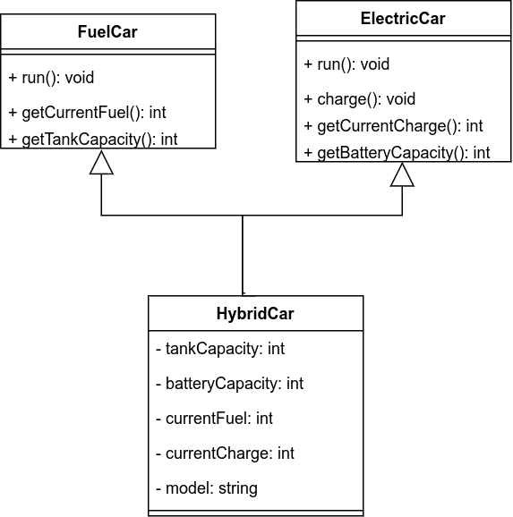

# CSE4122-Object-Oriented-Design-and-Design-Patterns-Lab

## Lab Assignment 1: Write a Java Program to Demonstrate Multiple Inheritance.

Here is a demo of the use of multiple inheritance using Java. Here, there are two interfaces: ElectricCar and FuelCar. The HybridCar class inherits from both these interfaces. The class diagram is given below:

 